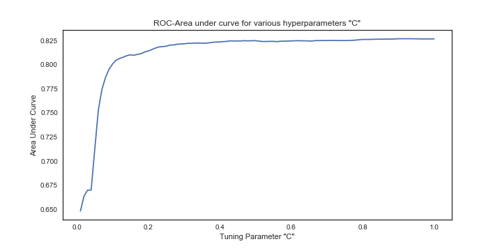

## Diabetes Among Pima Indian Women

#### Background
A dataset provided through the [National Institute of Diabetes and Digestive and Kidney Diseases](https://www.niddk.nih.gov/), this dataset contains records from 768 Pima women, each including diagnostic measures like BMI, insulin, and glucose and whether the woman has diabetes. A competition on [Kaggle](https://www.kaggle.com/uciml/pima-indians-diabetes-databasefrom) challenged data scientists to build a model to accurately predict whether a woman has diabetes based on her diagnostics.

#### Summary -- Approach

My goal is to identify diagnostics that most help to differentiate women with / without diabetes, and interpret the coefficients from the most promising model.

Classifiers to Compare:
* Logistic Regression with lasso
* Decision Trees
* Random Forest
* Gradient Boost


#### Summary - Findings

Presently no logistic regression model has the predictive power required for deployment. Other algorithms like Random Forest or Naive Bayes could be applied.

#### Table of Contents
1. [Measures of Success](#measures-of-success)
2. [Data](#data)
      * [Feature Engineering](#feature-engineering)
      * [Training, Validation and Test
Sets](#training,-validation-and-test-sets)
3. [Logistic Regression Models](#logistic-regression-models)
4. [Summary of Results](#summary-of-results)
5. [Next Steps](#next-steps)

#### Measures of Success

1. Area under the receiver operation characteristic curve (AUC-ROC)
2. Accuracy


#### Data

Over two million referrals placed by physicians for patients during the 2017 calendar year.


#### Data Dictionary

Name | Variable Name | Description | Type
------|----------|--------|----
**Outcome** (target) | outcome | 1 diabetes, else 0 | bin
Pregnancies | Pregnancies | number of times pregnant | numeric
Glucose | Glucose | Plasma glucose concentration a 2 hours in an oral glucose tolerance test | numeric
Blood Pressure | BloodPressure | Diastolic blood pressure (mm Hg) | numeric
Skin Thickness | SkinThickness | Triceps skin fold thickness (mm) | numeric
Insulin | Insulin | P2-Hour serum insulin (mu U/ml) | numeric
BMI | BMI | Body mass index (weight in kg/(height in m)^2) | numeric
Diabetes Pedigree | DPF | Diabetes pedigree function | numeric
Age | Age | Age (years) | numeric


#### Correlation Coefficients Between Target and Select Features


*It appears that glucose and BMI have the strongest positive correlation with outcomes.*

#### Distributions of BMI and Glucose by Outcome


#### Validation and Test sets

One quarter of the data set are held out as a test set, cross validation to be conducted on training set via k-folds.

## Classification Models

#### Model 1 - Logistic Regression with Lasso

*The Lasso penalizes high values of coefficients and is capable of pushing irrelvant coefficients to zero, thereby selecting features in a way. First we search over values of hyperparameter C, looking for the optimal penalty*



*We see that no values of C substantially improve ROC-AUC. Since there are not too many features in the data, lasso and ridge appear not to improve our model. This leads us to think that our model has a fair amount of bias without any penalty.*


Finally, we can use the bootstrap to see confidence intervals for coefficients to determine which have a strong influence on whether an individual may have diabetes.

```Python
## Function to bootstrap confidence intervals for coefficients
def bootstrap_ci_coefficients(X_train, y_train, num_bootstraps):
    X_train = X_train.values
    y_train = y_train.values
    bootstrap_estimates = []
    for i in np.arange(num_bootstraps):
        sample_index = np.random.choice(range(0, len(y_train)), len(y_train))
        X_samples = X_train[sample_index]
        y_samples = y_train[sample_index]
        lm = LogisticRegression()
        lm.fit(X_samples, y_samples)
        bootstrap_estimates.append(lm.coef_[0])
    bootstrap_estimates = np.asarray(bootstrap_estimates)
    return bootstrap_estimates
```
**Confidence Intervals for Logistic Coefficients**


*Features whose confidence intervals do not straddle 0 can be said to be statistically significant.  Such features include Pregnancies, Glucose, Blood Pressure & BMI*


#### Model 2 - Decision Tree

While the decision tree is not expected to outperform logistic or gradient boost, we perform it here as it can be helpful in determining which features are most useful in separating individuals with & without diabetes. At each potential split, a tree will use optimal features and cut points to increase order (decrease entropy).

**Tree with two Splits**

*This tree shows that women with higher levels of glucose and BMI over 29.95 are the most likely to have diabetes*

A tree that allows up to five splits performs nearly as well as logistic regression:


#### Model 3 - Gradient Boost Classifier

*Gradient Boost sequentially fits many weak models, each with high bias and low variance. The first predictor targets the outcome variable, but successive predictors target the error terms, looking for new variables that explain why the current "best" model isn't fitting. The model can produce very accurate results and is robust to overfitting.*


## Summary of Results

Accuracy of model is defined as (true positives + true negatives) / total guesses.  After a model is fit and tuned on training data, seeing how it performs on previously unseen test data is a good way to separate models.

Num | Model | ROC-AUC | Accuracy
---|----|-----|----
1 | Logistic - Referring Provider | 0.82 | 76%
2 | Decision Tree, 5 splits | 0.81 | 77
3 | Gradient Boost | 0.81 | 75%


#### References, Acknowledgements

This data was obtained through the [Kaggle website.](https://www.kaggle.com/uciml/pima-indians-diabetes-database)

It was originally gather and used in a 1988 paper:

Smith, J.W., Everhart, J.E., Dickson, W.C., Knowler, W.C., & Johannes, R.S. (1988). Using the ADAP learning algorithm to forecast the onset of diabetes mellitus. In Proceedings of the Symposium on Computer Applications and Medical Care (pp. 261--265). IEEE Computer Society Press.
